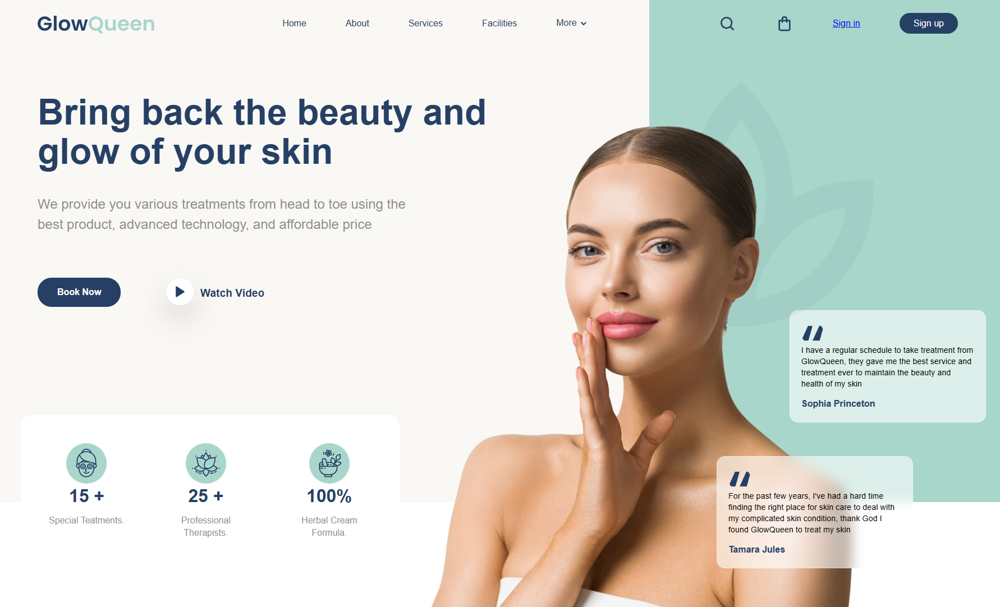

# 🌸 SPA & Beauty - Header Hero Section

Este proyecto es una sección "Hero" moderna, elegante y totalmente responsiva, diseñada específicamente para centros de estética, spas o marcas de cuidado personal que buscan una primera impresión impactante.

## ✨ Características

* **Diseño Premium:** Estética minimalista con una paleta de colores suave y profesional.
* **Código Limpio:** Estructura semántica en HTML5 y estilos modulares en CSS3.

## 🛠️ Tecnologías utilizadas

* **HTML5:** Estructura semántica.
* **CSS3:** Flexbox/Grid para el layout y variables personalizadas.
* **Google Fonts:** Tipografías seleccionadas para legibilidad y elegancia.

## 🚀 Instalación y Uso

Si quieres probar este proyecto localmente o integrarlo en tu propia web, sigue estos pasos:

1.  **Clona el repositorio:**
    ```bash
    git clone [https://github.com/Laurasace93/Header-hero-Spa-Beauty.git](https://github.com/Laurasace93/Header-hero-Spa-Beauty.git)
    ```
2.  **Navega a la carpeta:**
    ```bash
    cd Header-hero-Spa-Beauty
    ```
3.  **Abre el archivo `index.html`** en tu navegador preferido.

## 📸 Vista Previa

